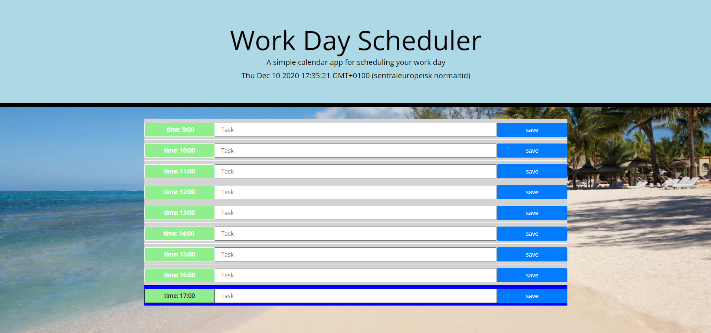
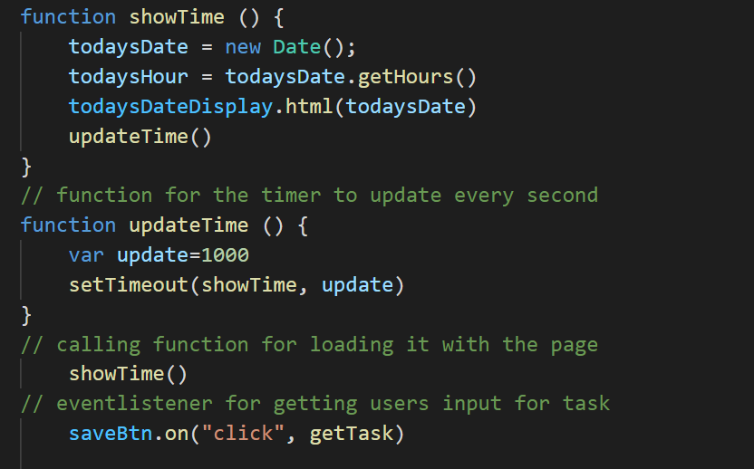
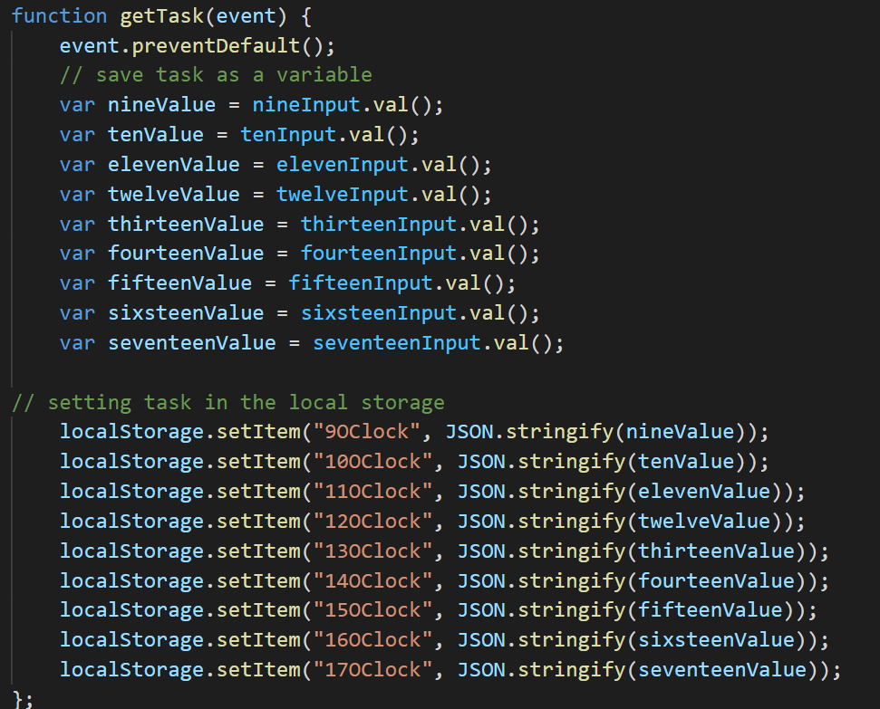
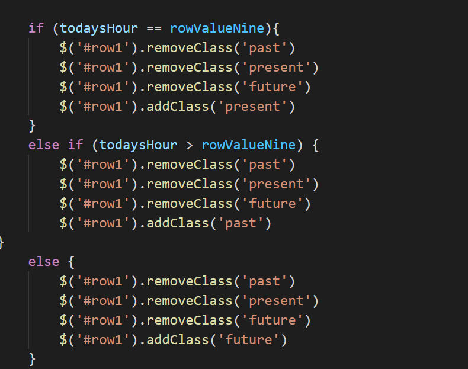

# weatherAPI

[Link to scheduler](https://nvrtis.github.io/scheduler/)

## Description

In this assignment the goal was to make a workday schedular that stores the task you input into local storage, updates the clocl and changes with time.

### Html

We already recieved a bit of code on the HTML with a bootstrap addon. From that i added on the container section with rows that displays time, have input field and a button. 

The most important part is the classes, id and the span wich has a value in it. These help me work with the javascript to make everything run  

### CSS

In the styling the most important thing that needs mentioning is the class present, past and future which changes with time

### Javascript

The Javascript start off with all the const which is used for shortening traveling the DOM in the script. It is saved as a const because it has no need to be changed during the script

the var list is for variable that will change during the script, such as todays date, which needs to be available with loading the page

The time that displays in the HTML and moves every second is done by 2 functions.
Showtime function gets a updated time, also and sets it in todaysDateDisplay in innerhtml before calling a updateTime function.

The updateTime function is all about reseting the showTime function every second, so that the timer gets updated 
We also call the showTime function so that it will be loaded with the page 

Then we have an eventlistener that will be called into action when the users presses save.

What will happen is that we save the users input into a variable. Then that variable will be stored in local storage with a key.

The next function is also something that we run with each page load, and that is displayText function.

This function will recieve the item from local storage, save it as a variable and then display whatever task the users had inputted previously in the input field when the user comes back to the page.

The rest if the code is if statments that will change the classes on each different row. These classes changes the background color of the row and other styling, such that the users have an easy view over what is the past, present and future. 

The statments goes through a loop to figure out with of the rows needs which class, and $(rowValue[i]).text() shows what value the time is on that row

It is also updating every minute to see if it needs to be changed with 2 functions. The first functions is one for updating the other function which checks the if statments 

